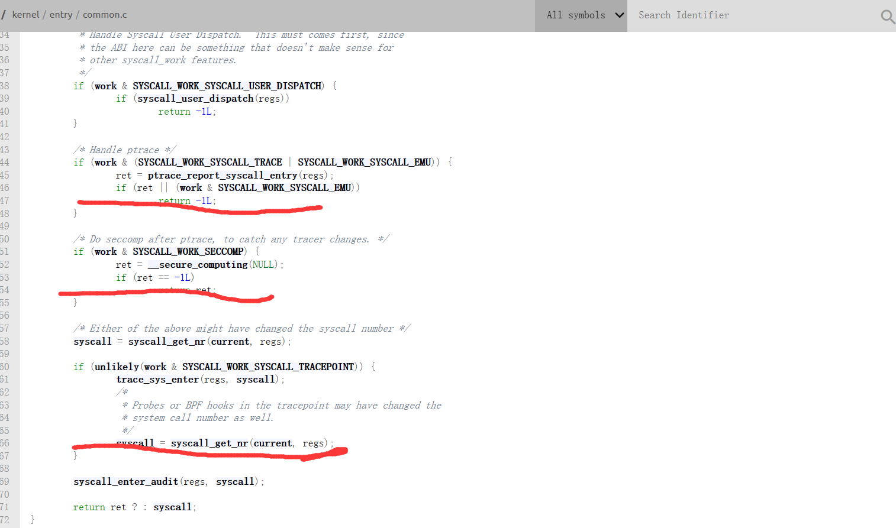

# rv_linux_bug
a descrption for a riscv linux bug


# bug summary

#### A ptrace bug in riscv linux , when tracer want to change tracee's a0 register in option PTRACE_SYSCALL to stop the tracee


# bug descrption

[218701 – tracer can't change a0 in tracee when use ptrace syscall option in riscv (kernel.org)](https://bugzilla.kernel.org/show_bug.cgi?id=218701)


# bug Reproduction

### compile code.c and test.c in riscv linux

```c
gcc code.c -o a.out
gcc test.c -o test
```

### put a.out test in the same directory

### execute a.out

```c
./a.out
```

### what do "a.out"  and "test" do ?

**The `a.out` program utilizes the `fork` system call to generate a `tracee` process, establishing a trace relationship with the parent process. The `tracee` process will proactively send a signal to halt at the `kill` point. Meanwhile, the `tracer` process employs the `PTRACE_SYSCALL` option to monitor the `enter` and `exit` of system calls within the child process. Upon detecting a `execve` system call, it modifies the `a0` register, which is the pointer register corresponding to the path of the ELF file.**

**if `a0 register` is set correctly , the  `test` can't be excute , and test is just print all its `argv and envp` **


# bug  analysis

**Take a look at this patch [[PATCH\] riscv: entry: Save a0 prior syscall_enter_from_user_mode() (kernel.org)](https://lore.kernel.org/lkml/20230403-crisping-animosity-04ed8a45c625@spud/T/) **

**we need to know that where will sleep in when tracee signal self in syscall enter. take a look at file in linux  `/arch/riscv/kernel/traps.c`  , the function  `do_trap_ecall_u` ,  every time process execute syscall will get in the function , and will be blocked in `syscall_enter_from_user_mode` if it is traced for syscall enter and exit . and you will know that regs->orig_a0 is be assigned before `syscall_enter_from_user_mode` . and if  we use ptrace for tracer to change the register , we can't change orig_a0 , we can only change a0, because riscv ptrace USERSPACE don't support the orig_a0 change.  so, actually , we can't change orig_a0 use PTRACE_SYSCALL option. **


# bug fix

**I think we should add orig_a0 to USERSPACE as other architecture such as x86 do , otherwise i have no idea how to deal with the bug in [[PATCH\] riscv: entry: Save a0 prior syscall_enter_from_user_mode() (kernel.org)](https://lore.kernel.org/lkml/20230403-crisping-animosity-04ed8a45c625@spud/T/) the same time we can normally use ptrace in riscv for option PTRACE_SYSCALL **


# what should I do to change my kernel to support ptrace and run proot

**Actually, I am unable to address this bug as I am not well-versed in RISCV Linux. However, if we wish to use proot for RISCV normally before this bug is resolved, we need to make some modifications to the local kernel. My local RISCV distribution is the openEuler 23.09 community edition. We need to insert the code "if(regs->orig_a0 != regs->a0 ) regs->orig_a0 = regs->a0" at the end of the syscall_trace_enter function in the file /kernel/entry/common.c. This approach is, in fact, quite unsightly as it involves adding RISCV-specific code into a generic architecture. Yet, it is effective. At the same time, it does not solve the problem introduced by the previous PATCH; it merely reduces the likelihood of the bug occurring. If you are very eager to experience RISCV proot, you can take this step.**




# testcase for riscv proot

**I have adopted the aforementioned strategy, so I cannot fully guarantee whether the reasons for the failed execution of the test cases are due to the aforementioned temporary method or issues with the ported code. However, under these circumstances, most of the proot test cases have passed, with only about seven failures more than the results obtained on the x86 platform.**

https://github.com/Jer6y/rv_linux_bug/assets/88422053/578bf9f6-5227-4c63-a282-eb4ae1af23da


# use proot on openEuler riscv to chroot 

https://github.com/Jer6y/rv_linux_bug/assets/88422053/4f343c1e-24ab-4c78-bade-29c190f30a16
